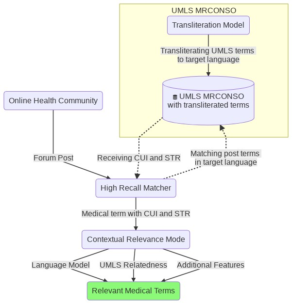
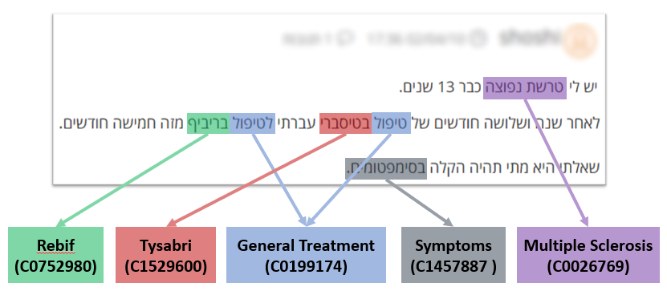

# MDTEL - Medical-Deep-Transliteration-Entity-Linking

This repository contains the code for the paper "Cross-Lingual UMLS Entity Linking in Online Health Communities" 

As described in the paper, there are 3 main steps: 

1. **Transliteration**: A forward transliteration model that we train and use to transliterate the UMLS into Hebrew.
2. **High Recall Matcher**: A matcher to match spans from the post to the transliterated UMLS, producing a high recall list of candidate
matches.
3. **Contextual Relevance**: A contextual relevance model that filters the high recall list by detecting matches that are not used in a medical
sense and produces a smaller, more relevant list. 

Here is a link to the data directory: https://drive.google.com/file/d/17JTxutH15P3R-Wd4x3d5ulY22KW0vVUC/view?usp=sharing  

**All the forum data is publicly available at www.camoni.co.il**




All of the paper results and table stats can be reproduced by simply running  
`python src\evaluate_contextual_relevance_model.py`  
This line will export all of the paper results and stats tables to the results directory at: `data\results`
> ls data\results  
>'Entity level performance.xlsx'    'Token level performance.xlsx' 
'Depression Token level performance report.xlsx'    'Sclerosis Token level performance report.xlsx'
'Diabetes Token level performance report.xlsx'    'Annotated terms stats.xlsx'
'High recall candidates filtered out.xlsx'         


## Setup   

First, download the data directory.  
You can simply open in on browser an download the zip file, but if you want, it is possible to perform the following cmd on linux:
`python download_gdrive.py 17JTxutH15P3R-Wd4x3d5ulY22KW0vVUC [target-path]`
  
Use the `envorinment.yml` file in order to create conda env with the necessary dependencies.  
```
conda env create -f environment.yml
conda activate mdtel_env
``` 

Config file - `config.py`.  
please change the current data path (`data_dir = r"E:\mdtel_data\data" + os.sep`) to your data directory.   

The manual labeled medical terms are at dir `data\manual_labeled_v2\doccano`

We now describe steps to reproduce each one of the steps.  

## Transliteration

The code for this part is here: https://github.com/snukky/news-translit-nmt

To run the transliteration training will require additional requirements that are specific at the news-translit-nmt repository. 

This step is composed of: 
1. Train a transliteration model on the training data at `data\transliteration\training_transliteration_model\synthesized_dataset_ready_for_training.txt`.
2. Use the trained model in order to predict - transliterate the umls data at `data\transliteration\inference_predict_all_umls\mrconso.txt`. 

The output of this step is the transliterated UMLS that we can now use for the next phase. 
The output is at `data\transliteration\inference_predict_all_umls\mrconso_transliterated.txt`.

## High Recall Matcher

Run the code `high_recall_matcher.py`.    
`python src\high_recall_matcher.py`  

The output will be at: `data\high_recall_matcher\output`

## Contextual Relevance

Run the code at `extract_contexual_relevance_model_features.py` in order to extract features for the contextual relevance model.  
`python src\contextual_relevance\extract_contexual_relevance_model_features.py`  

This code **extracts all of the features automatically**, no need to run each file in seperate. 

Then, run the code at `evaluate_contextual_relevance_model.py` in order to train and evaluate the contextual relevance model.  
`python src\evaluate_contextual_relevance_model.py`  
This line will export all of the paper results and stats tables to the results directory at: `data\results`

This step includes several parts:
1. Relatedness
2. Language model: ULMFiT and n-gram model
3. Match count and match frequency

After preparing all of the feature parts, we will have combined dataset with those features,
that can be used in order to evaluate the contextual relevance model.

This is how to produce each one of the features with new data (No need to run it, the `extract_contexual_relevance_model_features.py` already executed those files): 

### Language models
`extract_language_model_feats.py`

The data for this part is available at the data directory, and is originally from: http://u.cs.biu.ac.il/~yogo/hebwiki/

Training two language model.
First language model: Simple n-gram model. The code for this part is here: https://nlpforhackers.io/language-models/

The second language model is based on fastai language model. 

#### Fastai ULMFiT Model

* If an error rises while loading the language model, try to downgrade to pytorch=1.1.0

At inference step we added a function to fastai's `learner.py`, 
LanguageLearner class:
```python
def get_prob_of_word_in_context(self, context: str, word: str):
    self.model.reset()
    xb,yb = self.data.one_item(context)
    res = self.pred_batch(batch=(xb, yb))[0][-1]
    normalized_scores = F.softmax(res, dim=0)
    index_of_word = self.data.vocab.stoi[word]
    prob_of_word_given_context = normalized_scores[index_of_word]
    return prob_of_word_given_context
``` 

This function returns the probability of a word given context. 
For example we expect P(Red | This car is) > P(Frog | This car is) (P = get_prob_of_word_in_context)


### Relatedness
`extract_relatedness_features.py`

The software that is needed in order to use this part:
https://metacpan.org/pod/UMLS::Similarity

After installation, run the following command:

`umls-similarity.pl -user=root -password=admin --infile="eng_words_for_relatedness.txt" --measure=vector > output_relatedness.txt`

While 'eng_words_for_relatedness' is the terms you want to measure the relatedness, for example:

```
diabetes<>shivering
diabetes<>Terpsichore praeceps
diabetes<>Left geniohyoid
```
  
The relatedness output for our 3 communities is at "data\contextual_relevance\relatedness" at this format:
```
0.6983<>diabetes(C0011849)<>shivering(C0036973)
0.1726<>diabetes(C0011847)<>Terpsichore praeceps(C2820108)
0.4248<>diabetes(C0011849)<>Left geniohyoid(C0921041)
```

### Match count and match frequency

`extract_count_features.py`.     
This file simply prepares a Counter over the wikipedia data, and produces match count and match frequency for each match. 